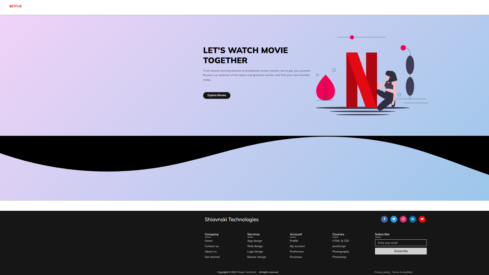

# My Project

This is an example project to demonstrate how to include images in a flexbox layout in a README file.

    

        
    

    

        
    

## Usage

To use this project, follow these steps:
1. Clone the repository.
2. Install dependencies.
3. Run the application.
